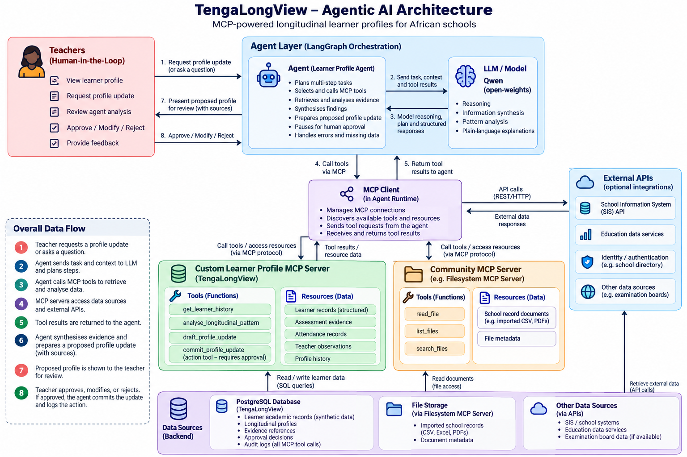

# Architecture

## Goal

TengaLongView updates a longitudinal learner profile from multi-term evidence while preserving a strict boundary: **the agent recommends; a named teacher decides**.

## Components

1. **Teacher demo UI** — starts a learner-profile task and provides the human approval/rejection decision.
2. **Learner Profile Agent** — plans a small multi-step workflow: retrieve → analyse → validate → draft → human gate.
3. **Open-weights LLM adapter** — optional Qwen via Ollama for one full synthesis task. The deterministic structured analysis remains the evidence source; the model may rephrase but may not invent evidence.
4. **MCP client** — connects the agent runtime to tool servers.
5. **Custom Learner Profile MCP server** — implemented with the MCP TypeScript SDK v2 and exposes reusable learner-history, longitudinal-analysis, draft and commit tools.
6. **Borrowed/community MCP server** — the official Filesystem MCP Server (`@modelcontextprotocol/server-filesystem`) reads synthetic imported school records from a sandboxed directory. We use it rather than reimplementing generic file access and path controls.
7. **PostgreSQL** — synthetic learner records, evidence IDs, drafts, approved updates and audit logs.
8. **Human gate** — `commit_profile_update` requires a named teacher and explicit decision.

## Data flow

Teacher request → agent plan → borrowed Filesystem MCP `read_text_file` → MCP `get_learner_history` → MCP `analyse_longitudinal_pattern` → source validation → optional Qwen synthesis → MCP `draft_profile_update` → **PAUSE** → teacher approve/modify/reject → MCP `commit_profile_update` → profile/audit persistence.

## Tool boundaries

- Retrieval and analysis are reversible/read-oriented.
- Draft creation is non-consequential and remains pending review.
- Profile commit is consequential and therefore gated.
- Every non-insufficient learner claim must contain known evidence IDs.

## Failure handling

- Fewer than three scored observations → no longitudinal strength/struggle claim is drafted.
- Missing learner → explicit error; no fabricated profile.
- Unknown evidence reference → validation failure.
- LLM unavailable → deterministic sourced statement remains usable.
- Missing teacher identity → write is refused.
- Prohibited ranking or prescriptive pathway language → text is rejected before commit.

